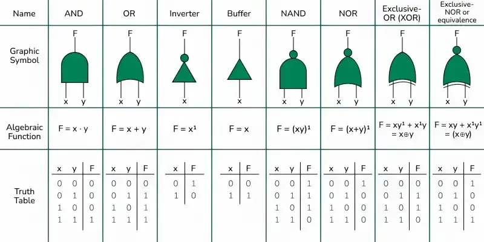

## BASIC LOGIC GATEWAY `[there are 8 logic gateways]`

Basicly you just need to remember these **`(3 + 1)`** logic gates. `[AND, OR, INVERTER, BUFFER + XOR]`. The rest will re-use from the prevoius sintax.



  - AND
  ```bash
  assign z = x & y;
  ```
  
  - OR
  ```bash
  assign z = x || y;
  ```
  
  - XOR [EXCLUSIVE-OR]
  ```bash
  assign z = x ^ y;
  ```
  - INVERTER
  ```bash
  assign z = ~x;
  ```

  - BUFFER
  ```bash
  assign z = x;
  ```

  - NOR [NOT-OR]
  ```bash
  assign z = ~(x | y);
  ```
  
  - NAND [NOT-AND]
  ```bash
  assign z = ~(x & y);
  ```
  
  - XNOR [EXCLUSIVE-NOR]
  ```bash
  assign z = ~( x ^ y);
  ```